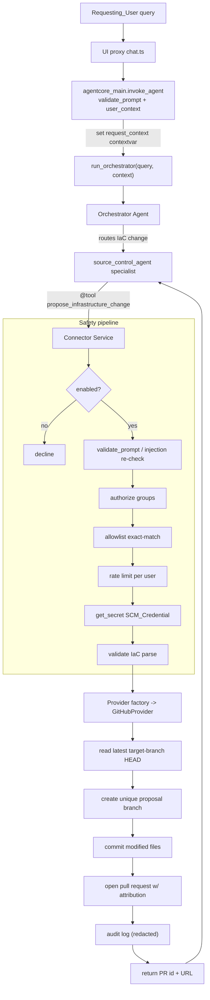

# Source Control Connector

> **Reference:** This document covers the **Source Control Connector** only. For the full
> platform guidance (overview, cost, deployment of the whole stack, MCP integration, testing,
> and more), see the public README:
> [aws-solutions-library-samples/guidance-for-game-backend-and-infrastructure-agentic-workflows](https://github.com/aws-solutions-library-samples/guidance-for-game-backend-and-infrastructure-agentic-workflows).

The Source Control Connector (the "Connector") adds a safe, **opt-in write path** to the Game
Backend & Infrastructure Agentic Workflows (GBAW) platform, which is otherwise read-only against
live AWS infrastructure. Instead of mutating live resources, the agent proposes
Infrastructure-as-Code (IaC) changes as **pull requests** against an IaC source repository. A
human reviews the proposal; the existing CI/CD pipeline applies it after merge.

## Table of Contents

- [Architecture](#architecture)
- [Safety Posture](#safety-posture)
- [Component Layering](#component-layering)
- [Enablement Gate](#enablement-gate)
- [Request Flow](#request-flow-propose-a-change)
- [The Safety Pipeline](#the-safety-pipeline)
- [Identity & Context Propagation](#identity--context-propagation)
- [Provider Abstraction](#provider-abstraction)
- [Configuration](#configuration)
- [IAM & Credential Isolation](#iam--credential-isolation)
- [Deployment Steps](#deployment-steps)
- [IaC Validation](#iac-validation)
- [Correctness Properties](#correctness-properties)
- [Source Layout](#source-layout)

## Architecture

The Connector is delivered as a **new dedicated specialist agent** built with the existing
`create_specialist_agent` factory and registered on the Orchestrator alongside the GameLift,
EKS, and Cost specialists. It exposes provider-agnostic `@tool` functions and routes all
source-control operations through a **common provider abstraction**, so additional providers
(GitLab, CodeCommit) can be added later without touching the agent-facing tools.


The Connector reuses existing platform components rather than re-implementing them:

| Concern | Reused component |
|---|---|
| Agent/tool construction | `agents/base_specialist.py::create_specialist_agent` |
| Credential retrieval | `utils/secrets.py::get_secret` (Secrets Manager, 5-min TTL cache, audit logging) |
| Config | `config/settings.py` (`GBAW_`-prefixed env vars) |
| Rate limiting | `utils/security.py::check_rate_limit`, `get_rate_limit_key`, `RateLimitExceeded` |
| Input validation / injection detection | `utils/security.py::validate_prompt`, `INJECTION_PATTERNS` |
| Audit redaction | `utils/security.py::sanitize_log_data`, `SENSITIVE_PATTERNS` |
| Authorization | `utils/security.py::verify_request_authorization` |
| Logging / audit sink | `utils/logger.py::logger` → stdout → ADOT/CloudWatch |

## Safety Posture

The design preserves the platform's core safety guarantees:

- **The AgentCore Runtime IAM role stays read-only against live AWS infrastructure.** The only
  new grant is `secretsmanager:GetSecretValue` scoped to a single secret ARN.
- **The write credential lives in a Secrets Manager secret** — never in IAM, never in an
  environment variable. That secret is the isolation boundary.
- **The Connector is disabled by default.** When disabled, the platform behaves exactly as it
  does today, and the `source_control_agent` is never registered on the Orchestrator.
- **The abstraction defines only read/propose operations.** There is deliberately **no** merge,
  approve, or close operation, so it is structurally impossible for the Connector to merge or
  close a proposal. Every change requires a human review and merge.

## Component Layering

The Connector is organized into four layers, from agent-facing down to the provider wire:

1. **Agent-facing tool layer** (`connector/tools.py`) — `@tool` functions
   (`get_iac_file`, `propose_infrastructure_change`) with provider-agnostic, JSON-serialisable
   signatures. Registered on the `source_control_agent` specialist. This is the only layer the
   Orchestrator/LLM sees. Tools never raise to the model; they return structured, secret-free
   dicts.
2. **Connector service layer** (`connector/service.py`) — orchestrates the safety pipeline for
   every operation (see below). Provider-agnostic.
3. **Provider abstraction layer** (`connector/provider.py`) — `SourceControlProvider` ABC
   defining a fixed operation set; a factory selects the concrete adapter from
   `GBAW_SCM_PROVIDER`.
4. **Provider adapter layer** (`connector/github_provider.py`) — `GitHubProvider` implements
   every operation against the GitHub REST API. Provider-specific types never escape this layer.

## Enablement Gate

At container startup (in `prewarm_container()` in `agentcore_main.py`), the Connector evaluates a
single `ConnectorConfig.load()` call that reads all `GBAW_SCM_*` variables and validates them.
The result is a frozen `ConnectorConfig` with an `enabled` boolean:

- `enabled` is `True` **only when** the enablement flag is truthy **and** every required value is
  present and valid — a supported provider with an available adapter, a non-empty allowlist,
  non-empty authorized groups, a secret **id** that is not a raw credential, and rate-limit /
  timeout / retry values in range.
- When `enabled` is `False`, the `source_control_agent` is **not** added to the Orchestrator's
  `tools=[...]` list, so no change-proposal tools are exposed. Any config error that forced
  disablement is written to the audit log identifying the offending values.

Disablement is the safe default and the *only* state reachable on misconfiguration —
`ConnectorConfig.load()` never raises; it accumulates every validation failure into
`config_errors` and forces `enabled=False`.

## Request Flow (propose a change)



Every gate runs **before** any source-control operation is issued and, on failure, returns a
typed error to the agent and records an audit entry — never leaving partial state.

## The Safety Pipeline

`propose_change` runs these gates in **exact order**, failing closed at each step:

1. **Enablement** — a disabled connector declines cleanly and exposes nothing.
2. **Input validation / injection** — `validate_prompt(intent, strict_mode=True)` plus an
   `INJECTION_PATTERNS` re-check across `intent`/`title`/`description`. Guardrails already run
   upstream in `invoke_agent`; this is the tool-boundary re-check. A flag → reject + audit.
3. **Authorization** — identity/groups are read **from the request contextvar** (never model
   input); `verify_request_authorization(...)` requires an authenticated user in one of
   `config.authorized_groups`. Unauthenticated vs. wrong-group are distinguished in the audit.
4. **Allowlist** — a **case-sensitive, full-string** match of `(repo, target_branch)` against
   `config.allowlist` (no partial/prefix/substring/wildcard). The effective repo/branch are
   taken from the **matched allowlist entry**, never from model input, so injected input cannot
   redirect a write.
5. **Rate limit** — `check_rate_limit(get_rate_limit_key(user_id, "scm_propose"), ...)`
   per-user; exceeding it returns a message stating the limit and reset time.
6. **Credential fetch** — `get_secret(config.credential_secret_id, source="secretsmanager")`
   within the provider timeout. Failure or timeout fails closed with no branch/PR.
7. **IaC validation** — `validate_iac(files, iac_format)`. Empty file sets are declined cleanly;
   malformed content is declined with the offending file named.
8. **Provider ops** (transient-only retries, up to `retry_max_attempts`):
   `latest_commit_sha` → generate a unique `proposal_branch` (regenerated on collision) →
   `create_branch` → `commit_files` → `open_pull_request` with agent + user attribution. A
   `ProviderAuthError` is **never** retried; only `ProviderTransientError` is.
9. **Audit + return** — writes a success audit entry; if that audit write fails, the action is
   aborted atomically and an audit-persistence error is returned. Success is **never** reported
   without a durable audit record.

Failure-mode mapping: connect/read timeout → `ProviderUnavailableError`/`ProviderTransientError`;
HTTP 401/403 → `ProviderAuthError` (no retry); HTTP 409 → `ProviderConflictError` (no destructive
resolution); HTTP 5xx/429 → `ProviderTransientError` (retryable). If PR creation fails **after**
a branch was created, the Connector reports failure and never reports success.

## Identity & Context Propagation

The `create_specialist_agent` factory produces a `@tool` whose only declared argument is
`query: str`, so the Connector tools cannot receive the `Requesting_User` identity through the
tool call. Deriving identity from tool/model arguments would also be **spoofable** by a
prompt-injected model.

The chosen mechanism is a request-scoped `contextvars.ContextVar` in `utils/request_context.py`:

```python
_request_context: ContextVar[dict] = ContextVar("gbaw_request_context", default={})
def set_request_context(ctx: dict) -> Token: return _request_context.set(ctx)
def get_request_context() -> dict: return _request_context.get()
def reset_request_context(token) -> None: _request_context.reset(token)
```

It is **set** in `agentcore_main.invoke_agent` immediately before `run_orchestrator` and **reset**
in a `finally` block, so identity is isolated per invocation and never leaks across requests:

```python
_token = set_request_context(agent_context)
try:
    response = run_orchestrator(query=user_prompt, context=agent_context)
finally:
    reset_request_context(_token)
```

The Connector service layer reads `user_id` and Cognito `groups` via `get_request_context()`.
**The Connector derives the Requesting_User strictly from the request context, never from
agent/model-supplied input.**

## Provider Abstraction

A fixed operation set shared by all adapters. All parameters and return values use
provider-agnostic dataclasses; no GitHub type is referenced in the signatures.

```python
class SourceControlProvider(ABC):
    def get_file(self, repo, branch, path) -> FileContent | None: ...
    def get_files(self, repo, branch, paths) -> FileFetchResult: ...
    def branch_exists(self, repo, branch) -> bool: ...
    def latest_commit_sha(self, repo, branch) -> str: ...
    def create_branch(self, repo, new_branch, from_sha) -> None: ...
    def commit_files(self, repo, branch, files, message) -> str: ...
    def open_pull_request(self, repo, head, base, title, body) -> PullRequestResult: ...
```

Typed exceptions (`ProviderUnavailableError`, `ProviderAuthError`, `ProviderConflictError`,
`ProviderTransientError`, `UnsupportedProviderError`) let the service layer react uniformly. The
factory selects the adapter:

```python
def get_provider(config: ConnectorConfig) -> SourceControlProvider:
    if config.provider == "github":
        return GitHubProvider(config)
    raise UnsupportedProviderError(config.provider)   # caught at load -> disabled
```

**GitHub adapter details.** Uses `httpx` (pinned) with a per-request timeout from
`GBAW_SCM_PROVIDER_TIMEOUT_SECONDS`; **no local `git clone`** (the container FS is read-only) —
it uses the GitHub Git Data / Contents REST endpoints. The credential is fetched per-operation
via `get_secret(...)`, placed in the `Authorization` header, and never logged. Outbound HTTPS to
`api.github.com` (or a configured GitHub Enterprise base URL) must be allowed from the AgentCore
runtime.

## Configuration

All configuration is read **exclusively** from `GBAW_`-prefixed environment variables; any other
source is ignored. Raw parsing lives in `config/settings.py`; validation and the `enabled`
decision live in `ConnectorConfig.load()` so misconfiguration → disabled + audit, never an
import-time crash.

| Variable | Default | Notes |
|---|---|---|
| `GBAW_SCM_CONNECTOR_ENABLED` | `false` | Truthy = case-insensitive `{"true","1","yes"}` (trimmed) |
| `GBAW_SCM_PROVIDER` | — | e.g. `github` |
| `GBAW_SCM_CREDENTIAL_SECRET_ID` | — | Secrets Manager id/ARN (a **raw credential** value is rejected) |
| `GBAW_SCM_REPO_ALLOWLIST` | — | See grammar below |
| `GBAW_SCM_AUTHORIZED_GROUPS` | — | Comma-separated Cognito groups |
| `GBAW_SCM_RATE_LIMIT_MAX` | `5` | 1..1000 |
| `GBAW_SCM_RATE_LIMIT_WINDOW_SECONDS` | `3600` | 60..86400 |
| `GBAW_SCM_PROVIDER_TIMEOUT_SECONDS` | `30` | 1..300 |
| `GBAW_SCM_RETRY_MAX_ATTEMPTS` | `3` | 1..10 |
| `GBAW_SCM_MAX_FILES_PER_REQUEST` | `20` | Read-path cap |
| `GBAW_SCM_IAC_KB_ID` | — | Optional IaC Knowledge Base; wires a `retrieve` tool when set |

**Repository allowlist grammar** — a compact, env-friendly encoding parsed into `AllowlistEntry`s:

```
allowlist  := entry ( ";" entry )*
entry      := repo "=" branch ( "," branch )*
# example:   org/iac-repo=main,release;org/other-iac=main
```

Comparison at the tool boundary is case-sensitive, full-string on both `repo` and
`target_branch` — no partial/prefix/wildcard matching.

## IAM & Credential Isolation

Exactly one scoped statement is added to the existing `AgentCoreExecutionRole` in
`infrastructure/cloudformation/01-base-infrastructure.yaml`. **No live-infrastructure write
actions are added.**

```yaml
- PolicyName: ScmCredentialAccess
  PolicyDocument:
    Version: '2012-10-17'
    Statement:
      - Sid: ScmCredentialRead
        Effect: Allow
        Action: secretsmanager:GetSecretValue
        Resource: !Ref ScmCredentialSecretArn   # scoped to the connector secret only
```

`ScmCredentialSecretArn` is a template parameter defaulting to empty, gated by a `Condition`, so
read-only deployments that never set it are unaffected. The secret is **operator-provisioned**
(not created by the stack), so the write token never lives in template state.

## Deployment Steps

The Connector ships **disabled**. To enable it against a GitHub IaC repository:

1. **Provision the write credential.** Create a Secrets Manager secret containing a scoped GitHub
   token (or GitHub App installation token) with `contents:write` and `pull_requests:write` on
   the target repo. Note its ARN.

2. **Grant scoped read of that secret.** Deploy the base infrastructure stack with the
   `ScmCredentialSecretArn` parameter set to the secret's ARN. This adds the single
   `secretsmanager:GetSecretValue` statement scoped to that ARN (and nothing else).

3. **Set the connector environment.** Provide the `GBAW_SCM_*` variables (see
   [Configuration](#configuration)). At minimum:

   ```bash
   export GBAW_SCM_CONNECTOR_ENABLED=true
   export GBAW_SCM_PROVIDER=github
   export GBAW_SCM_CREDENTIAL_SECRET_ID=<secrets-manager-id-or-arn>
   export GBAW_SCM_REPO_ALLOWLIST="org/iac-repo=main,release"
   export GBAW_SCM_AUTHORIZED_GROUPS="scm-writers"
   ```

   Only the **secret id** is ever passed as an env var — never the credential value.

4. **Deploy.** `scripts/deploy.sh` wires all `GBAW_SCM_*` vars through the existing
   `agentcore launch --auto-update-on-conflict -env KEY=VALUE` mechanism (the same path used for
   KB IDs and prompt ARNs). Runtime dependencies `httpx` and `python-hcl2` are added in
   `pyproject.toml`, locked in `uv.lock`, and exported to `requirements.txt`.

5. **Allow egress.** Ensure the AgentCore runtime can reach the provider host
   (`api.github.com` or your GitHub Enterprise base URL) over HTTPS.

6. **Verify.** On startup, `ConnectorConfig.load()` validates the config. If enabled and valid,
   the `source_control_agent` is registered on the Orchestrator and the routing rule for
   infrastructure-change proposals becomes active. If anything is invalid, the Connector stays
   disabled and the reason is written to the audit log.

## IaC Validation

Validation runs **before** any branch/commit/PR call and operates on the agent-proposed file
contents in memory (read-only FS friendly):

- **CloudFormation** — parsed with a CFN-aware YAML/JSON loader that tolerates intrinsic short
  tags (`!Ref`, `!Sub`, `!GetAtt`, …). Structural checks require a non-empty top-level
  `Resources` map with a `Type` on each resource.
- **Terraform** — parsed with `python-hcl2`.

Any parse or structural failure raises `IaCValidationError` naming the offending file and reason,
and the proposal is declined without touching the repository.

## Correctness Properties

The Connector is validated by 22 property-based tests (Hypothesis, `@settings(max_examples=100)`)
plus example, smoke, and a credential-gated integration test. Highlights:

| # | Property |
|---|---|
| 1–2 | Truthy + valid config enables; not-truthy/any-invalid config disables and records offending values |
| 3 | Enablement governs tool exposure (specialist registered iff enabled) |
| 4–5 | Allowlist parse round-trip; operations occur **only** on an exact allowlist match |
| 6 | Authorization gate (authenticated **and** in an authorized group) |
| 7 | Per-user proposal rate limit |
| 8–9 | Credential values never appear in output; credential-retrieval failure is fail-closed |
| 10–11 | Successful proposal integrity; proposal branch is unique and based on the latest target commit |
| 12–13 | File read scoping/limit/missing-file reporting; non-file-expressible requests declined cleanly |
| 14–15 | IaC validation precedes writes; injection-flagged input blocks all operations |
| 16–20 | Provider unavailability is safe; invalid credentials not retried; PR-failure-after-branch never reports success; conflicts reported without destructive resolution; transient errors retried up to the configured maximum |
| 21–22 | Create/decline audit records are complete; audit-write failure aborts the action atomically |

## Source Layout

```
backend/src/
├── connector/
│   ├── config.py            # ConnectorConfig, AllowlistEntry, load() + validation
│   ├── models.py            # FileContent, FileFetchResult, ProposedFile, PullRequestResult, ProposalResult
│   ├── provider.py          # SourceControlProvider ABC + typed exceptions
│   ├── github_provider.py   # GitHubProvider adapter + get_provider factory
│   ├── iac_validation.py    # CloudFormation / Terraform validation
│   ├── service.py           # read_iac_files + propose_change safety pipeline
│   └── tools.py             # get_iac_file, propose_infrastructure_change (@tool)
├── agents/
│   ├── source_control_specialist.py   # source_control_agent + GitOps prompt
│   └── orchestrator.py                # conditional registration when enabled
├── config/settings.py                 # GBAW_SCM_* env parsing
└── utils/request_context.py           # request-scoped identity contextvar

infrastructure/cloudformation/01-base-infrastructure.yaml   # scoped secret-read IAM grant
scripts/deploy.sh                                           # GBAW_SCM_* env wiring
```
