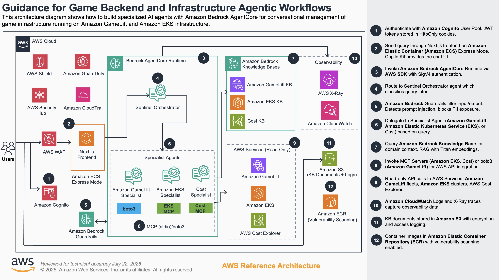

# Guidance for Game Backend & Infrastructure Agentic Workflows

This guidance demonstrates how to build an AI-powered game server management platform using a multi-specialist agent architecture on AWS. It uses Amazon Bedrock AgentCore Runtime with Strands Agents and Model Context Protocol (MCP) servers to provide natural language interaction with AWS game infrastructure services including Amazon GameLift, Amazon EKS, and AWS Cost Explorer.

## Table of Contents

- [Overview](#overview)
- [Architecture](#architecture)
- [Cost](#cost)
- [Prerequisites](#prerequisites)
- [Deployment](#deployment)
- [Local Development](#local-development)
- [Usage](#usage)
- [MCP Integration](#mcp-integration)
- [Testing](#testing)
- [Monitoring and Observability](#monitoring-and-observability)
- [Project Structure](#project-structure)
- [Security](#security)
- [Cleanup](#cleanup)
- [Contributing](#contributing)
- [License](#license)
- [Notices](#notices)

## Overview

This solution implements a conversational AI assistant that helps game developers manage AWS infrastructure through natural language queries. A central orchestrator agent routes requests to domain-specific specialist agents, each equipped with MCP servers or AWS SDK tools for their respective AWS services.

Key capabilities:

- **GameLift Management** -- Fleet monitoring, scaling configuration, and game session analysis
- **EKS/Kubernetes Operations** -- Cluster management, pod monitoring, and troubleshooting
- **Cost Intelligence** -- Spending analysis, forecasting, and optimization recommendations
- **Conversation Memory** -- Session-scoped context with optional cross-session long-term memory
- **Guardrails** -- Content filtering, PII protection, and prompt injection detection via Amazon Bedrock Guardrails

### Specialist Agents

| Agent | Domain | Integration |
|-------|--------|-------------|
| **Orchestrator** | Query routing and multi-turn reasoning | Delegates to specialists |
| **GameLift Specialist** | Fleet management, scaling, optimization | boto3 tools + Knowledge Base |
| **EKS Specialist** | Kubernetes cluster operations | EKS MCP Server + Knowledge Base |
| **Cost Specialist** | Spending analysis and forecasting | Cost Explorer MCP Server + Knowledge Base |

## Architecture

The solution uses AWS Bedrock AgentCore Runtime with embedded stdio MCP servers. All MCP servers run as subprocesses within the AgentCore container -- no external infrastructure is required for the agent backend.



### Request Flow

1. User authenticates via Amazon Cognito (JWT tokens in HttpOnly cookies)
2. User sends a natural language query through the Next.js frontend on ECS Express (Fargate + ALB)
3. Frontend invokes Bedrock AgentCore Runtime using the AWS SDK with SigV4 authentication
4. AgentCore routes the request to the Orchestrator agent
5. Amazon Bedrock Guardrails filter input for prompt injection, off-topic content, and PII
6. Orchestrator classifies the query and delegates to the appropriate specialist agent
7. Specialist queries its Bedrock Knowledge Base for domain-specific context (RAG)
8. Specialist invokes MCP servers (EKS, Cost Explorer) or boto3 tools (GameLift) for live AWS data
9. Read-only API calls execute against target AWS services with least-privilege IAM policies
10. Response flows back through the chain to the user

### Technology Stack

| Layer | Technology |
|-------|------------|
| Frontend | Next.js, TypeScript, CopilotKit, AWS SDK v3 |
| Backend | Python 3.13, Strands Agents, Bedrock AgentCore SDK |
| AI Models | Amazon Bedrock (Claude Haiku 4.5 for orchestration, Claude Sonnet 4.6 for specialists) |
| MCP Servers | AWS Labs MCP servers (EKS, CCAPI, Cost Explorer) via stdio transport |
| Authentication | Amazon Cognito with group-based authorization |
| Infrastructure | AWS CloudFormation, ECS Express (Fargate + ALB), ECR |
| Observability | Amazon CloudWatch, AWS X-Ray, OpenTelemetry |

### Model strategy and overrides

The orchestrator uses Claude Haiku 4.5 for low-latency routing. GameLift, EKS, and Cost specialists use Claude Sonnet 4.6 for deeper reasoning and client-side tool use. Both roles retain prompt caching, streaming behavior, and Bedrock Guardrails.

Override the roles with `GBAW_ORCHESTRATOR_MODEL_ID` and `GBAW_SPECIALIST_MODEL_ID`. Existing deployments may continue using `GBAW_BEDROCK_MODEL_ID` and `GBAW_BEDROCK_MODEL_ID_SECONDARY`; a non-empty role-based variable takes precedence over its legacy alias, followed by the repository default. Process environment values take precedence over `ui/.env.local`. Foundation, system inference profile, and application inference profile IDs are accepted.

The roles are not a failover order. Botocore adaptive retries apply to both configured models, but the runtime never substitutes one role model for the other. After retries are exhausted, orchestrator failures reach the top-level request handler; specialist failures follow the existing service behavior, returning an AWS SDK/CLI fallback when configured or a generic retry message.

## Cost

You are responsible for the cost of the AWS services used while running this Guidance. As of August 2026, the cost for running this Guidance with the default settings in the US West (Oregon) Region is approximately **~$752/month** for processing approximately 10,000 agent queries per month.

We recommend creating a [Budget](https://docs.aws.amazon.com/cost-management/latest/userguide/budgets-managing-costs.html) through [AWS Cost Explorer](https://aws.amazon.com/aws-cost-management/aws-cost-explorer/) to help manage costs. Prices are subject to change. For full details, refer to the pricing webpage for each AWS service used in this Guidance.

### Sample Cost Table

The following table provides a sample cost breakdown for deploying this Guidance with the default parameters in the US West (Oregon) Region (`us-west-2`) for one month, assuming approximately 10,000 agent queries (each query invokes the Haiku orchestrator and one Sonnet specialist with RAG context, ~8 model turns per query). Token costs shown are at standard (uncached) rates using the default `global.*` cross-region inference model IDs. Prompt caching is enabled by default; cache reads cost 0.1× standard input while cache writes cost 1.25× (5-min TTL). Break-even requires a cache-read share above ~22% of total cached tokens (R/W ratio > 0.28). Minimum cache checkpoint: 1,024 tokens for Claude Sonnet 4.6, 4,096 tokens for Claude Haiku 4.5.

| AWS service | Dimensions | Cost [USD] |
| ----------- | ------------ | ------------ |
| Amazon Bedrock (Claude Sonnet 4.6) | 80M input tokens @ $3.00/M + 20M output tokens @ $15.00/M (specialist agents, global cross-region endpoint) | $540.00 |
| Amazon Bedrock (Claude Haiku 4.5) | 40M input tokens @ $1.00/M + 10M output tokens @ $5.00/M (orchestrator, global cross-region endpoint) | $90.00 |
| Amazon ECS (Fargate) | 1 vCPU + 2 GB task. At MinTasks: 1 running 730 hrs/mo = $36.04. Autoscaling may average ~1.3 tasks under moderate load (~950 task-hrs/mo ≈ $47). [Pricing](https://aws.amazon.com/fargate/pricing/) | $36.04 |
| Amazon Bedrock Guardrails | 10K queries × 4 guarded calls/query × ≤1K input chars + ≤1K output chars = 40K input TU + 40K output TU. Each TU evaluated by: content filters ($0.15/1K) + denied topics ($0.15/1K) + PII ($0.10/1K). Total: (40,000 + 40,000) / 1,000 × ($0.15 + $0.15 + $0.10). [Pricing](https://aws.amazon.com/bedrock/pricing/) | $32.00 |
| Elastic Load Balancing (ALB) | 1 ALB @ $0.0225/hr × 730 hrs = $16.43 fixed. LCU variable: ~100K requests/mo, 1 new conn/req, 30s duration, 100 KB total request+response data/req, ≤10 listener rules, no mutual TLS. Max LCU dimension is processed bytes (~10 LCU-hrs × $0.008 = $0.08). [Pricing](https://aws.amazon.com/elasticloadbalancing/pricing/) | $16.51 |
| Amazon Bedrock AgentCore Memory | STM: ~30K new events/mo (~3 per query) @ $0.25/1K events = $7.50. LTM retrieval: 10K requests/mo @ $0.50/1K requests = $5.00 (billed even for empty results). LTM record storage: ~1K retained records (10% of queries store one user-fact record) @ $0.25/1K records/mo = $0.25. [Pricing](https://aws.amazon.com/bedrock/agentcore/pricing/) | $12.75 |
| AWS WAF | 1 WebACL ($5) + 6 rules ($6) + ~100K requests @ [$0.60/M](https://aws.amazon.com/waf/pricing/) | $11.06 |
| Amazon CloudWatch + AWS X-Ray | ~5 GB log ingestion @ $0.50/GB + metrics + X-Ray traces (1% indexing, ~10K spans) | ~$7.50 |
| Amazon Bedrock AgentCore Runtime | 10K invocations, ~30s session each. CPU billed on active consumption only (~5s active CPU @ $0.0895/vCPU-hr); memory billed for full session duration (2 GB peak × 30s @ $0.00945/GB-hr) | ~$2.84 |
| AWS CloudTrail | Management events (first trail free); associated S3 + CloudWatch Logs delivery | ~$1.00 |
| AWS KMS | 1 customer-managed key ($1/mo) + API requests | ~$1.00 |
| Amazon S3 (logs + docs + artifacts) | 5 buckets, ~5 GB standard storage + requests | ~$0.50 |
| Amazon Bedrock (Titan Text Embeddings V2) | KB ingestion (~50 doc chunks) + 10K retrieval queries @ [$0.02/M input tokens](https://aws.amazon.com/bedrock/pricing/) | ~$0.20 |
| Amazon Inspector | ECR scanning: 2 images × $0.09 initial + monthly rescans @ $0.01 | ~$0.20 |
| Amazon ECR | Image storage (~2 GB) @ $0.10/GB-month | $0.20 |
| Amazon S3 Vectors (Knowledge Bases) | 3 indexes, ~50 vectors (1024-dim), 10K queries/mo @ [$2.50/M requests](https://aws.amazon.com/s3/pricing/) + data processed | ~$0.10 |
| Amazon Cognito | 1,000 monthly active users (within free tier) | $0.00 |
| **Total** | | **~$752/month** |

> **Note:** The dominant cost driver is model token usage (Sonnet + Haiku = $630, or 84% of total). Infrastructure costs are minimal at this query volume. Token volumes above are estimates based on ~8 model turns per query; actual costs depend on conversation length and specialist complexity. HTTP request volume is estimated at ~100K/month (10K agent queries × ~10 HTTP requests each for auth, polling, streaming, and static assets); ALB and WAF rows use this shared assumption. Prompt caching break-even requires a cache-read share above ~22% of cached tokens — monitor `CacheReadInputTokenCount` vs `CacheWriteInputTokenCount` in CloudWatch. Minimum cache checkpoint: 1,024 tokens (Sonnet 4.6), 4,096 tokens (Haiku 4.5).

## Prerequisites

### Required Tools

| Tool | Version | Installation |
|------|---------|--------------|
| AWS CLI | v2+ | [Install Guide](https://docs.aws.amazon.com/cli/latest/userguide/getting-started-install.html) |
| Node.js | 18+ | [Download](https://nodejs.org/) |
| uv | 0.9+ | `curl -LsSf https://astral.sh/uv/install.sh \| sh` |
| yq | v4+ | [Install Guide](https://github.com/mikefarah/yq#install) |
| Docker | Latest (optional) | [Install Guide](https://docs.docker.com/get-docker/) |

Python 3.13 and the AgentCore CLI are automatically installed by `uv` during setup. Docker is only required for building and deploying the frontend container image; frontend deployment steps are skipped if Docker is not available.

### AWS Account Requirements

- **Bedrock Model Access**: Claude Sonnet 4.6 and Claude Haiku 4.5 enabled in your target region
- **Service Quotas**: Default quotas are sufficient for most deployments
- **IAM Permissions**: Administrator access (or equivalent) for initial deployment

<details>
<summary><strong>Minimum IAM permissions (click to expand)</strong></summary>

If you cannot use Administrator access, the deploying principal needs permissions for:

| Service | Actions Required | Purpose |
|---------|-----------------|---------|
| CloudFormation | Full stack CRUD | Deploy/update/delete all stacks |
| IAM | Create/manage roles and policies | Service roles for ECS, AgentCore, etc. |
| Amazon ECR | Repository CRUD, image push | Frontend container registry |
| Amazon ECS | Service/task management | Frontend hosting |
| Amazon Cognito | User pool CRUD | Authentication |
| Amazon Bedrock | Model access, Guardrails, Knowledge Bases, AgentCore | AI agents and safety |
| Amazon S3 | Bucket CRUD, object operations | Knowledge Base storage, CloudTrail logs |
| CloudWatch Logs | Log group CRUD, delivery management | Observability |
| AWS X-Ray | Trace read/write | Distributed tracing |
| AWS CodeBuild | Project CRUD, build execution | AgentCore Runtime deployment |
| AWS WAF | WebACL CRUD | Frontend protection |
| AWS CloudTrail | Trail CRUD | API audit logging |
| Amazon Inspector | Enable scanning | Container vulnerability scanning |
| AWS STS | GetCallerIdentity | Credential verification |

The CloudFormation templates use `CAPABILITY_NAMED_IAM` to create scoped service roles with least-privilege access.

</details>

To enable Bedrock models:

1. Open the [Amazon Bedrock console](https://console.aws.amazon.com/bedrock/)
2. Navigate to **Model access**
3. Enable Anthropic Claude Sonnet 4.6 and Anthropic Claude 4.5 Haiku
4. Save changes

### Windows Users

Native Windows support is provided via the PowerShell module in `scripts/powershell/`. See [scripts/powershell/README.md](scripts/powershell/README.md) for setup and usage.

```powershell
Import-Module ./scripts/powershell/GameAgent.psd1
Deploy-GameAgent -Profile <your-profile>   # Full deployment
Remove-GameAgent -Profile <your-profile>   # Full teardown
```

**Prerequisites:** PowerShell 7.0+ and AWS CLI v2. No WSL2 or Linux environment required.

## Deployment

### Full AWS Deployment

**Step 1:** Configure and verify AWS credentials (run `aws configure` separately — it's interactive):
```bash
aws configure
aws sts get-caller-identity  # Verify credentials work
```

**Step 2:** Create environment configuration and deploy:
```bash
# Create environment configuration
cp ui/.env.local.example ui/.env.local

# Deploy all infrastructure (8 automated steps)
./deploy-all.sh
# Optional: override AWS profile (can also be set in ui/.env.local)
# AWS_PROFILE=<your-profile> ./deploy-all.sh

# Create an admin user for the Cognito user pool
./scripts/infrastructure/add-admin-user.sh

# Run tests against the deployed stack
./test-full.sh
```

The deployment script provisions the following resources:

1. Base infrastructure (Cognito user pool, IAM roles, ECR repositories)
2. Bedrock Guardrails (content filtering, PII protection)
3. Managed prompts (Bedrock Prompt Management)
4. Account-level observability configuration
5. AgentCore Runtime (backend container via CodeBuild)
6. Bedrock Knowledge Bases (GameLift, EKS, Cost documentation)
7. Frontend infrastructure (ECS Express + ALB)
8. Security infrastructure (WAF, CloudTrail, Inspector)

See [docs/DEPLOYMENT_GUIDE.md](docs/DEPLOYMENT_GUIDE.md) for detailed step-by-step deployment instructions and environment variable reference.

## Local Development

```bash
# Install backend dependencies
cd backend && uv sync && cd ..

# Create environment configuration (if not already done)
cp ui/.env.local.example ui/.env.local

# Start both backend (port 8080) and frontend (port 3000)
./dev-start.sh

# Access the UI at http://localhost:3000

# Stop all services
./dev-stop.sh
```

In local development mode:

- AgentCore Runtime runs locally with all specialist agents
- MCP servers run embedded via stdio transport
- Frontend connects directly to the local backend (no Cognito auth by default)
- AWS service access (GameLift, EKS, Cost Explorer) uses your local AWS credentials

### Backend Only

```bash
cd backend
uv sync
source .venv/bin/activate
python src/agentcore_main.py
```

### Frontend Only

```bash
cd ui
npm install
npm run dev
```

## Usage

Once the application is running (locally or deployed), interact with the AI assistant through the chat interface.

### GameLift Management

```
"Show me my GameLift fleets"
"How is my production fleet performing?"
"What scaling configuration does my fleet use?"
```

### EKS/Kubernetes Operations

```
"List my EKS clusters"
"Show me failing pods in the default namespace"
"What's the status of my game-agones-cluster?"
```

### Cost Analysis

```
"What's my current AWS spending?"
"How much am I spending on GameLift vs EKS?"
"Show me cost optimization opportunities"
```

### Authentication

- **Development mode** (`NEXT_PUBLIC_SKIP_AUTH=true`): No authentication required (default in `.env.local`)
- **Production mode** (`NEXT_PUBLIC_SKIP_AUTH=false`): Cognito authentication enforced; users must be in the `admin` or `users` group

## MCP Integration

All three MCP servers use stdio transport exclusively. They run as embedded subprocesses within the AgentCore Runtime container.

| MCP Server | Purpose | Specialist |
|------------|---------|------------|
| `awslabs.eks-mcp-server` | Kubernetes cluster management | EKS Specialist |
| `awslabs.aws-api-mcp-server` | AWS CLI bridge for resource discovery (e.g. `aws eks list-clusters`) | EKS Specialist |
| `awslabs.cost-explorer-mcp-server` | Cost analysis and forecasting | Cost Specialist |

MCP clients are created through a thread-safe factory (`utils/mcp_client_factory.py`) with automatic retry and fallback to boto3 when MCP servers are unavailable.

### Enrolling EKS Clusters

To enable full Kubernetes API access (pods, deployments, services), enroll your EKS clusters:

```bash
cd infrastructure/kubernetes

# Basic enrollment
./enroll-cluster.sh my-cluster us-west-2

# With audit logging
./enroll-cluster.sh my-cluster us-west-2 --enable-audit-logs

# Deregister a cluster
./deregister-cluster.sh my-cluster us-west-2
```

Enrollment configures read-only Kubernetes RBAC and updates the `aws-auth` ConfigMap. Secrets are explicitly excluded from the read-only permissions.

## Testing

The project includes unit, integration, end-to-end, and AI evaluation tests.

### Quick Start

```bash
# Unit tests only (no deployment or running services needed)
./test-unit.sh

# Full smart test suite (auto-detects deployment status)
./test-full.sh
```

### Test Categories

| Command | Description | Requirements |
|---------|-------------|--------------|
| `./test-unit.sh` | Backend + frontend unit tests | None |
| `./test-local.sh` | Unit tests only | None |
| `./test-cloud.sh` | Cloud integration tests | Deployed stack |
| `./test-e2e.sh` | End-to-end browser tests | Running services |
| `./test-ai-evals.sh` | AI behavior evaluation | Deployed stack |
| `./test-stress.sh` | Performance and load tests | Deployed stack |
| `./test-memory.sh` | Memory subsystem tests | Deployed stack |

### Backend Tests (pytest)

```bash
cd backend
pytest -m unit              # Fast unit tests (mocked)
pytest -m integration       # Integration tests (real services)
pytest -m cloud             # Cloud-only tests (requires deployment)
pytest -m ai_eval           # AI evaluation tests
```

### Frontend Tests

```bash
cd ui
npm test                    # Jest unit tests
npm run test:coverage       # Coverage report
npm run test:e2e            # Playwright E2E tests
npm run test:e2e:smoke      # Smoke tests only
```

## Monitoring and Observability

The solution integrates with Amazon CloudWatch and AWS X-Ray for monitoring and distributed tracing.

- **CloudWatch Logs**: Structured JSON logs from all components (14-day retention for application logs, 90-day for audit logs)
- **AWS X-Ray**: Distributed tracing across the full request flow, from frontend through AgentCore to AWS service calls
- **OpenTelemetry**: Instrumentation for traces and metrics exported via ADOT (AWS Distro for OpenTelemetry)

```bash
# View runtime logs
aws logs tail /aws/bedrock-agentcore/runtimes/gameagentruntime-<ID>-DEFAULT --follow

# View frontend logs
aws logs tail /ecs/game-agent-frontend --follow
```

X-Ray traces are available in the AWS Console under CloudWatch > Gen AI Observability > AgentCore.

## Project Structure

```
sample-game-backend-agentic-workflows/
├── backend/                        # Python AgentCore Runtime backend
│   ├── src/
│   │   ├── agents/                 # Orchestrator and specialist agents
│   │   ├── config/                 # Configuration (settings.py)
│   │   ├── models/                 # AI model configurations
│   │   ├── utils/                  # MCP client factory, logging, timing
│   │   └── agentcore_main.py       # AgentCore Runtime entrypoint
│   └── tests/                      # Unit, integration, and AI evaluation tests
├── ui/                             # Next.js frontend
│   ├── src/
│   │   ├── components/             # React components (Chat)
│   │   ├── pages/                  # Next.js pages and API routes
│   │   └── lib/                    # Utility libraries
│   └── __tests__/                  # Frontend tests
├── infrastructure/                 # CloudFormation templates and Kubernetes scripts
│   ├── cloudformation/             # IaC deployment templates
│   └── kubernetes/                 # EKS cluster enrollment scripts
├── scripts/                        # Deployment and development automation
│   ├── deploy.sh                   # Main deployment logic
│   ├── teardown.sh                 # Main teardown logic
│   ├── powershell/                 # PowerShell module for Windows (Deploy-GameAgent, etc.)
│   ├── dev/                        # Development environment scripts
│   ├── test/                       # Testing automation
│   └── infrastructure/             # Infrastructure utilities
├── docs/                           # Additional documentation
│   ├── ARCHITECTURE.md             # Detailed architecture documentation
│   ├── DEPLOYMENT_GUIDE.md         # Step-by-step deployment guide
│   ├── SECURITY.md                 # Security controls and compliance
│   ├── THREAT_MODEL.md             # STRIDE threat analysis
│   └── DEPENDENCY_MATRIX.md        # Dependency versions and pinning rationale
├── deploy-all.sh                   # Full AWS deployment (wrapper)
├── teardown-all.sh                 # Full AWS teardown (wrapper)
├── dev-start.sh                    # Start local development
├── dev-stop.sh                     # Stop local development
├── test-full.sh                    # Run all tests (auto-detects mode)
└── test-unit.sh                    # Run unit tests
```

Root-level shell scripts are convenience wrappers that delegate to the corresponding scripts in `scripts/`.

## Security

> **📖 Full documentation:** [SECURITY.md](SECURITY.md) (encryption, data protection, trust boundaries, patching) | [docs/THREAT_MODEL.md](docs/THREAT_MODEL.md) (STRIDE threat analysis with attack trees)

This solution implements defense-in-depth security controls across all layers:

| Layer | Controls |
|-------|----------|
| **Authentication** | Amazon Cognito with JWT tokens, group-based authorization, admin-only user creation |
| **Transport** | TLS 1.2+ enforced on all connections (AWS-managed certificates) |
| **Encryption** | AES-256 encryption at rest for all data (S3, CloudWatch, AgentCore Memory) |
| **Authorization** | IAM least-privilege policies with read-only access to target services |
| **AI Safety** | Amazon Bedrock Guardrails for content filtering, PII anonymization, and prompt injection detection |
| **Input Validation** | Prompt sanitization, injection pattern detection, sensitive data redaction ([utils/security.py](backend/src/utils/security.py)) |
| **Audit** | CloudTrail logging for all AWS API calls, CloudWatch for application activity |
| **Vulnerability Scanning** | AWS Inspector for container images, Dependabot for dependency updates |
| **No Static Credentials** | All service-to-service authentication uses IAM roles with automatic credential rotation |

## Cleanup

To remove all deployed resources:

```bash
AWS_PROFILE=<your-profile> ./teardown-all.sh
```

The teardown script is idempotent and removes resources in reverse deployment order.

## Contributing

See [CONTRIBUTING.md](CONTRIBUTING.md) for guidelines on reporting bugs, suggesting features, and submitting pull requests.

## License

This library is licensed under the MIT-0 License. See the [LICENSE](LICENSE) file.

## Notices

Customers are responsible for making their own independent assessment of the information in this Guidance. This Guidance: (a) is for informational purposes only, (b) represents AWS current product offerings and practices, which are subject to change without notice, and (c) does not create any commitments or assurances from AWS and its affiliates, suppliers or licensors. AWS products or services are provided "as is" without warranties, representations, or conditions of any kind, whether express or implied. AWS responsibilities and liabilities to its customers are controlled by AWS agreements, and this Guidance is not part of, nor does it modify, any agreement between AWS and its customers.
