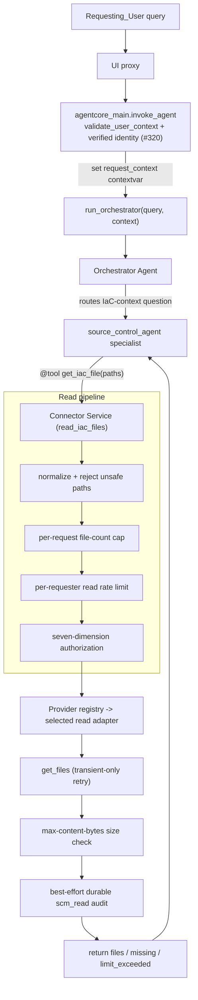

# Source Control Connector

> **Reference:** This document covers the **Source Control Connector** only. For the full
> platform guidance (overview, cost, deployment of the whole stack, MCP integration, testing,
> and more), see the [root README](../README.md).

The Source Control Connector (the "Connector") adds a safe, **opt-in read-only** IaC-context path
to the Game Backend & Infrastructure Agentic Workflows (GBAW) platform, which is otherwise
read-only against live AWS infrastructure. Rather than mutating live resources — or writing to the
source-control provider — the agent **reads existing Infrastructure-as-Code (IaC) sources** from
an allowlisted repository/branch so it can review the current source of truth. A file read is a
provider-neutral concept; each provider adapter maps it to the provider's native read API (the
GitHub contents API, and so on). Per **Architecture Update v1.3** the provider-**write** path
(creating an unmerged change proposal for human review, then merging via the existing CI/CD
pipeline) has **moved out of the chat runtime into the isolated #314 executor**; the read-only
Connector documented here holds **no write credential** and exposes **no** propose/merge/commit
operation. The read-only posture is a property of the type graph — the shipped package has no
`SourceControlWriter` interface and no importable, callable, or attribute-reachable provider-write
operation — not merely a runtime guard.

## Table of Contents

- [Architecture](#architecture)
- [Safety Posture](#safety-posture)
- [Component Layering](#component-layering)
- [Enablement Gate](#enablement-gate)
- [Request Flow](#request-flow-read-iac-files)
- [The Read Pipeline](#the-read-pipeline)
- [Authorization](#authorization)
- [Identity & Context Propagation](#identity--context-propagation)
- [Provider Abstraction](#provider-abstraction)
- [Configuration](#configuration)
- [IAM & Credential Isolation](#iam--credential-isolation)
- [Deployment Steps](#deployment-steps)
- [Audit](#audit)
- [Correctness Properties](#correctness-properties)
- [Source Layout](#source-layout)

## Architecture

The Connector is delivered as a **dedicated specialist agent** built with the existing
`create_specialist_agent` factory (`agents/source_control_specialist.py`, `service_name="SourceControl"`)
and registered on the Orchestrator alongside the GameLift, EKS, and Cost specialists — but **only
when the Connector is enabled**. It exposes a single provider-agnostic `@tool` function and routes
the read operation through a **common provider abstraction**, so additional providers (GitLab,
CodeCommit) can be added later without touching the agent-facing tool.


The Connector reuses existing platform components rather than re-implementing them:

| Concern | Reused component |
|---|---|
| Agent/tool construction | `agents/base_specialist.py::create_specialist_agent` |
| Credential retrieval | `utils/secrets.py::get_secret` (Secrets Manager, 5-min TTL cache, audit logging) |
| Config | `config/settings.py` (`GBAW_`-prefixed env vars) |
| Rate limiting | `utils/security.py::check_rate_limit`, `get_rate_limit_key`, `RateLimitExceeded` |
| Audit redaction | `utils/security.py::sanitize_log_data` |
| Request-scoped identity | `utils/request_context.py` (`set_request_context` / `get_request_context`) |
| Logging / local visibility | `utils/logger.py::logger` → stdout → ADOT/CloudWatch |

Authorization is **not** delegated to a shared helper; it is the Connector's own seven-dimension
`AuthorizationPolicy` (see [Authorization](#authorization)).

## Safety Posture

The design preserves the platform's core safety guarantees:

- **The AgentCore Runtime IAM role stays read-only against live AWS infrastructure.** The only
  new grants are `secretsmanager:GetSecretValue` scoped to a single read-credential secret ARN and
  (optionally) `logs:CreateLogStream` + `logs:PutLogEvents` scoped to the dedicated connector audit
  log group. No live-infrastructure write actions are added.
- **The read credential lives in a Secrets Manager secret** — never in IAM, never in an
  environment variable (only its ARN is passed as an env var). That secret is the isolation
  boundary, and it is a provider-scoped, fine-grained **read-only** token.
- **The Connector is disabled by default.** When disabled, the platform behaves exactly as it
  does today, and the `source_control_agent` is never registered on the Orchestrator.
- **The abstraction defines only read operations.** There is deliberately **no** write, merge,
  approve, commit, or close operation and no `SourceControlWriter` interface, so it is
  structurally impossible for the chat runtime to mutate a provider. The provider-write path lives
  in the isolated #314 executor, not here.

## Component Layering

The Connector is organized into four layers, from agent-facing down to the provider wire:

1. **Agent-facing tool layer** (`connector/tools.py`) — the single `@tool` function
   `get_iac_file(paths, repository=None, target_branch=None)` with a provider-agnostic,
   JSON-serialisable signature. Registered on the `source_control_agent` specialist. This is the
   only layer the Orchestrator/LLM sees. The tool never raises to the model; it returns a
   structured, secret-free dict, converting any unexpected exception into a safe `error` dict.
2. **Connector service layer** (`connector/service.py`) — `read_iac_files(...)` orchestrates the
   read pipeline for every read (see below). Provider-agnostic.
3. **Provider abstraction layer** (`connector/provider.py`) — the `SourceControlReader` ABC
   defining the fixed **read** operation set (`get_file`/`get_files`) plus the neutral
   `ProviderAuth` credential-acquisition contract; a registry (`connector/registry.py`) selects the
   concrete adapter from the configured provider name.
4. **Provider adapter layer** (`connector/github_provider.py`) — a concrete adapter implements the
   read operations against its provider's REST API. Provider-specific types never escape this
   layer. The first adapter targets GitHub; additional adapters (GitLab, CodeCommit) plug in
   without changing the layers above.

## Enablement Gate

At container startup (and whenever the Orchestrator is built in `agents/orchestrator.py`), the
Connector evaluates a single `SourceControlConfig.load()` call that reads all `GBAW_SCM_*`
variables and validates them. `SourceControlConfig` composes **three** cohesive sub-contracts, each
of which reads its own slice of the `GBAW_SCM_*` values and accumulates its own `config_errors`:

- **`DomainConfig`** (IaC change domain) — the repository allowlist (`authorization_policy`) and
  the `authorized_groups`.
- **`ConnectorConfig`** (provider-neutral core) — `provider`, rate-limit max/window, provider
  timeout, retry attempts, `max_files_per_request`, `max_content_bytes`, and the audit log group.
- **`AdapterConfig`** (provider adapter) — the read-credential secret ARN and the optional provider
  base URL.

The composed result is a frozen `SourceControlConfig` with an `enabled` boolean:

- `enabled` is `True` **only when** the enablement flag is truthy **and every** sub-contract
  validates — a supported provider with a registered adapter, a non-empty allowlist, non-empty
  authorized groups, an ARN-shaped read-credential secret ARN, a present audit log group, and
  rate-limit / timeout / retry / size values in range.
- When `enabled` is `False`, the `source_control_agent` is **not** appended to the Orchestrator's
  specialist tools list, so no read tool is exposed. Any config error that forced disablement is
  written to the audit log (`event="scm_config_error"`), with every field passed through
  `sanitize_log_data` so no raw credential can leak.

Disablement is the safe default and the *only* state reachable on misconfiguration —
`SourceControlConfig.load()` **never raises**; when the flag is not truthy it short-circuits to a
well-formed disabled off state (no errors, no audit), and when the flag is truthy but validation
fails it accumulates every failure across the three sub-contracts into `config_errors`, emits one
configuration-error audit entry, and forces `enabled=False`.

## Request Flow (read IaC files)



Identity, tenant, workspace, and groups come **only** from the trusted request context (never from
tool/model arguments). Each rejection path returns a fail-closed result (empty files, or
`limit_exceeded=True` for the count cap) and records an `scm_read` audit entry.

## The Read Pipeline

`read_iac_files` runs these steps in order, failing closed at each one before any provider read:

1. **Path normalization / rejection** — each requested path is canonicalized to a repo-relative
   POSIX path by `_normalize_path`. A path is **rejected** (not silently rewritten) when it is
   **absolute** (leading `/`), contains **any** `..` segment, or contains a **NUL byte or
   backslash**; rejection raises `PathTraversalError`, which the caller converts into a fail-closed
   empty result and a `path_invalid` audit with no provider read.
2. **Per-request file-count cap** — if the number of requested paths exceeds
   `config.connector.max_files_per_request`, no provider fetch is performed and a `FileFetchResult`
   with `limit_exceeded=True` is returned plus a `limit_exceeded` audit.
3. **Read rate limit** — `check_rate_limit(get_rate_limit_key(requester, "scm_read"), ...)`
   per-requester; exceeding it returns an empty result and a `rate_limited` audit.
4. **Authorization** — the requested `(repository, target_branch)` selectors (defaulting to the
   first allowlist entry / its first branch when omitted), the normalized paths, and the
   requester's tenant/workspace/groups are evaluated against all **seven** dimensions (see below).
   On a violation of any dimension the read is rejected with no provider read and an audit naming
   the failed dimension; the effective repo/branch always come from the matched allowlist entry,
   never from free-form input.
5. **Provider read (transient-only retry)** — the selected `SourceControlReader.get_files` fetches
   exactly the normalized paths from the matched repo/branch. A `ProviderTransientError`
   (provider rate limits, temporary 5xx/unavailability, read timeouts) is retried up to
   `config.connector.retry_max_attempts` total attempts; a `ProviderAuthError` and any other
   permanent `ProviderError` are **not** retried. A **terminal** provider failure records a durable
   sanitized `scm_read` `outcome="error"` audit (the reason is the exception **class name** only —
   never a message, token, or provider payload) and then re-raises, so the tool wrapper still
   returns its safe error dict.
6. **Size check** — a result whose total content size exceeds `config.connector.max_content_bytes`
   is rejected with no files served and a `size_exceeded` audit.
7. **Served-read audit** — the served read is durably audited
   (requester / tenant / workspace / effective repo / effective branch / normalized paths /
   found count / missing) with `outcome` of `served` or `not_found`. The result carries **no**
   write-usable revision.

Failure-mode mapping (GitHub adapter): connect error / connect-timeout → `ProviderUnavailableError`;
read/transport timeout → `ProviderTransientError`; HTTP 401/403 → `ProviderAuthError` (no retry);
HTTP 429/5xx → `ProviderTransientError` (retryable); other 4xx → `ProviderError` (no retry). A
`404` on a read is treated as "file absent" and reported as a missing path, not an error.

## Authorization

Authorization is enforced by the Connector's own `AuthorizationPolicy.authorize(...)`
(`connector/config.py`), wrapping the operator-approved allowlist entries owned by `DomainConfig`.
It is a stateless evaluator over **seven dimensions**, evaluated in order; the **first** failing
dimension is reported in the returned `Decision.failed_dimension`:

1. **tenant** — entries whose `tenants` is empty (any tenant) or list the request's tenant are
   eligible; if none are eligible, fail on `tenant`.
2. **workspace** — among tenant-eligible entries, those whose `workspaces` is empty (any) or list
   the workspace remain eligible; if none, fail on `workspace`.
3. **repository** — at least one eligible entry's `repo` must equal the requested repo (exact,
   case-sensitive, full-string).
4. **branch** — collect **every** repo-matching eligible entry that lists the branch in its
   `target_branches` (exact, case-sensitive). If none, fail on `branch`. (All matches are kept, so
   an operator can list several entries for the same repo+branch that each scope different
   paths/extensions.)
5. **path** — the request passes when **at least one** of the branch-matching entries permits every
   requested path: an entry with `path_prefixes` requires each path to start with one of them; an
   empty `path_prefixes` permits any path.
6. **extension** — among the entries that passed the path check, the request passes when at least
   one also permits every requested extension (`str.endswith`); an empty `extensions` permits any
   extension. The first entry passing **both** path and extension becomes the **matched** entry and
   supplies the effective repo/branch. If some entry passed the path check but none passed the
   extension check, the failed dimension is `extension`; otherwise `path`.
7. **group** — the requester's `groups` must intersect `config.domain.authorized_groups`.

On success the `Decision` carries the effective repo/branch from the matched entry; on denial it
carries only the failed dimension and no provider read is performed. Because multiple matching
entries are all considered, a request is authorized when **any** single matching entry permits all
of the requested paths and extensions.

## Identity & Context Propagation

The `create_specialist_agent` factory produces a `@tool` whose declared arguments are the read
selectors (`paths`, and optional `repository`/`target_branch`) — never the `Requesting_User`
identity. Deriving identity from tool/model arguments would be **spoofable** by a prompt-injected
model, so identity is taken from a request-scoped context instead.

The mechanism is a request-scoped `contextvars.ContextVar` in `utils/request_context.py`. In
`agentcore_main.invoke_agent`, the **verified frontend identity** forwarded to the AgentCore
runtime (PR #320) is validated by `validate_user_context` (which allow-lists the permitted keys and
sanitizes their values) and placed into `agent_context` — `user_id`, Cognito `groups`, `tenant`,
and `workspace`. It is **set** immediately before `run_orchestrator` and **reset** in a `finally`
block, so identity is isolated per invocation and never leaks across requests:

```python
_context_token = set_request_context(agent_context)
try:
    response = run_orchestrator(query=user_prompt, context=agent_context)
finally:
    reset_request_context(_context_token)
```

The Connector service layer reads `user_id`, `groups`, `tenant`, and `workspace` via
`get_request_context()` (in `_read_path_context`). **The Connector derives the requester, tenant,
workspace, and groups strictly from the request context, never from agent/model-supplied input.**

**Trust boundary (PR #319 finding F2 / PR #320).** `validate_user_context` only allow-lists and
sanitizes the identity keys; it does **not** itself re-verify the origin or authenticity of the
forwarded identity. The validated values are the only identity the Connector's authorization gate
trusts, so this runtime endpoint must remain reachable **only** via the verified frontend
boundary that forwards that identity.

## Provider Abstraction

A fixed **read** operation set shared by all adapters. All parameters and return values use
provider-agnostic dataclasses (`connector/models.py`: `FileContent`, `FileFetchResult`) or Python
primitives; no provider-specific type is referenced in the signatures. There is deliberately **no**
write, merge, approve, or close operation and no `SourceControlWriter` interface.

```python
class SourceControlReader(ABC):
    def get_file(self, repo: str, branch: str, path: str) -> FileContent | None: ...
    def get_files(self, repo: str, branch: str, paths: list[str]) -> FileFetchResult: ...
```

Credential acquisition is owned by each adapter behind a neutral `ProviderAuth` contract
(`apply(request: OutboundRequest) -> None`), so the connector core issues no credential retrieval of
its own and a token-based adapter and a future IAM-native (SigV4) adapter satisfy the same contract.

Typed exceptions (`ProviderUnavailableError`, `ProviderAuthError`, `ProviderTransientError`,
`ProviderError`, `UnsupportedProviderError`) let the service layer react uniformly. A
provider-neutral registry (`connector/registry.py`) selects the adapter for the configured provider
and fails closed when no adapter is registered:

```python
def get_provider(config: SourceControlConfig) -> SourceControlReader:
    provider_name = config.connector.provider
    factory = _REGISTRY.get(provider_name) if provider_name is not None else None
    if factory is None:
        raise UnsupportedProviderError(provider_name)   # caught at load -> disabled
    return factory(config)
```

Adapters **self-register** at import time (`registry.register("github", GitHubProvider)`), so the
neutral core never imports a concrete adapter module.

**Adapter details (GitHub example).** The GitHub adapter uses `httpx` with a per-request timeout
from `GBAW_SCM_PROVIDER_TIMEOUT_SECONDS`; **no local `git clone`** (the container FS is read-only) —
it calls the GitHub Contents REST endpoint. The read credential is fetched fresh per operation via
`get_secret(config.adapter.read_credential_secret_arn, source="secretsmanager")`, placed in the
`Authorization: Bearer <token>` header, and never logged. Outbound HTTPS to the provider host
(`api.github.com`, or a configured enterprise base URL) must be allowed from the AgentCore runtime.

## Configuration

All configuration is read **exclusively** from `GBAW_`-prefixed environment variables; any other
source is ignored. Raw parsing lives in `config/settings.py`; validation and the `enabled`
decision live in `SourceControlConfig.load()` (composing `DomainConfig` / `ConnectorConfig` /
`AdapterConfig`) so misconfiguration → disabled + audit, never an import-time crash.

| Variable | Default | Required when enabled | Notes |
|---|---|---|---|
| `GBAW_SCM_CONNECTOR_ENABLED` | `false` | — | Truthy = case-insensitive `{"true","1","yes"}` (trimmed) |
| `GBAW_SCM_PROVIDER` | — | ✅ | e.g. `github`; must have a registered adapter |
| `GBAW_SCM_READ_CREDENTIAL_SECRET_ARN` | — | ✅ | Fully-qualified Secrets Manager secret **ARN** (no wildcards). A bare name or raw credential is rejected and its value omitted from audit output |
| `GBAW_SCM_REPO_ALLOWLIST` | — | ✅ | See grammar below; must parse to ≥1 entry |
| `GBAW_SCM_AUTHORIZED_GROUPS` | — | ✅ | Comma-separated Cognito groups; ≥1 required |
| `GBAW_SCM_AUDIT_LOG_GROUP` | — | ✅ | CloudWatch Logs group backing the durable audit sink |
| `GBAW_SCM_RATE_LIMIT_MAX` | `5` | — | 1..1000 |
| `GBAW_SCM_RATE_LIMIT_WINDOW_SECONDS` | `3600` | — | 60..86400 |
| `GBAW_SCM_PROVIDER_TIMEOUT_SECONDS` | `30` | — | 1..300 |
| `GBAW_SCM_RETRY_MAX_ATTEMPTS` | `3` | — | 1..10 |
| `GBAW_SCM_MAX_FILES_PER_REQUEST` | `20` | — | Positive int; per-request read cap |
| `GBAW_SCM_MAX_CONTENT_BYTES` | `1048576` | — | Positive int; max total content bytes per read (1 MiB) |
| `GBAW_SCM_PROVIDER_BASE_URL` | — | — | Optional; when set must be an absolute **https** URL (self-hosted/enterprise endpoint) |

Out-of-range or non-integer numeric values fall back to their documented default **and** accumulate
a config error (which disables the connector).

**Repository allowlist grammar** — a compact, env-friendly encoding parsed by `_parse_allowlist`
into `AllowlistEntry` values. Entries are `;`-separated; each entry splits on the first `=` into a
repo and a spec, and the spec is up to **five** `:`-separated segments:

```
allowlist  := entry ( ";" entry )*
entry      := repo "=" branches [ ":" paths [ ":" extensions
                                  [ ":" tenants [ ":" workspaces ] ] ] ]
branches   := branch ( "," branch )*   # required, ≥1
paths      := prefix ( "," prefix )*   # optional; empty => any path
extensions := ext    ( "," ext )*      # optional; empty => any extension
tenants    := tenant ( "," tenant )*   # optional; empty => any tenant
workspaces := ws     ( "," ws )*       # optional; empty => any workspace

# repo+branch only (backward compatible):  org/iac-repo=main,release
# fully specified:  org/iac=main,release:infra/,modules/:.yaml,.tf:acme:prod,staging
```

A **missing** segment means "any" for that dimension, so existing repo+branch-only entries parse
exactly as before. Parsing is fail-closed: an entry with no `=`, an empty repository, no branches,
or more than five `:`-separated groups is a per-entry error that disables the connector. Empty
`;`-separated segments are ignored (a trailing separator is harmless). Repository/branch comparison
at the tool boundary is case-sensitive, full-string — no partial/prefix/wildcard matching.

## IAM & Credential Isolation

Two scoped, conditional statements are added to the existing `AgentCoreExecutionRole` in
`infrastructure/cloudformation/01-base-infrastructure.yaml`. **No live-infrastructure write actions
are added.**

```yaml
- !If
  - ScmReadCredentialActive
  - PolicyName: ScmReadCredentialAccess
    PolicyDocument:
      Version: '2012-10-17'
      Statement:
        - Sid: ScmReadCredentialRead
          Effect: Allow
          Action: secretsmanager:GetSecretValue
          Resource: !Ref ScmReadCredentialSecretArn   # scoped to the connector read secret only
  - !Ref 'AWS::NoValue'
```

Relevant template parameters and conditions:

- **`ScmReadCredentialSecretArn`** (parameter) — empty, or a fully-qualified Secrets Manager secret
  ARN. Its `AllowedPattern` **disallows `*` and `?` wildcards** so a broad ARN cannot widen the
  scoped grant to multiple secrets. The secret is **operator-provisioned** (not created by the
  stack), so the token never lives in template state.
- **`ScmConnectorEnabled`** (parameter, default `'false'`) — `deploy.sh` passes `'true'` only when
  `GBAW_SCM_CONNECTOR_ENABLED` is truthy.
- **`ScmReadCredentialActive`** (condition) = `ScmConnectorIsEnabled` **AND**
  `ScmReadCredentialConfigured`. The `GetSecretValue` statement is added **only** when both hold, so
  a disabled deployment carries no connector secret permission even if an ARN is otherwise present.
- **`ScmAuditLogGroupName`** (parameter) + **`ScmAuditLogGroupConfigured`** (condition) — when set,
  the template creates the `ScmAuditLogGroup` (`AWS::Logs::LogGroup`, 90-day retention) and adds a
  scoped `ScmAuditLogAccess` policy (`Sid: ScmAuditLogWrite`) granting `logs:CreateLogStream` +
  `logs:PutLogEvents` on that log group only.

## Deployment Steps

The Connector ships **disabled**. To enable it against an IaC repository (GitHub shown as the
example provider):

1. **Provision the read credential.** Create a Secrets Manager secret containing a provider-scoped,
   fine-grained **read-only** token for the target repo. Note its fully-qualified ARN.

2. **Grant scoped read of that secret (and provision the audit log group).** Deploy the base
   infrastructure stack with `ScmReadCredentialSecretArn` set to the secret's ARN,
   `ScmConnectorEnabled=true`, and `ScmAuditLogGroupName` set to the audit log group name. This adds
   the single `secretsmanager:GetSecretValue` statement scoped to that ARN plus the scoped audit-log
   write grant — and nothing else.

3. **Set the connector environment.** Provide the `GBAW_SCM_*` variables (see
   [Configuration](#configuration)). At minimum:

   ```bash
   export GBAW_SCM_CONNECTOR_ENABLED=true
   export GBAW_SCM_PROVIDER=github
   export GBAW_SCM_READ_CREDENTIAL_SECRET_ARN=arn:aws:secretsmanager:us-west-2:123456789012:secret:gbaw/scm-read-AbCdEf
   export GBAW_SCM_REPO_ALLOWLIST="org/iac-repo=main,release"
   export GBAW_SCM_AUTHORIZED_GROUPS="iac-reviewers"
   export GBAW_SCM_AUDIT_LOG_GROUP="/gbaw/scm-audit"
   ```

   Only the secret **ARN** is ever passed as an env var — never the credential value.

4. **Deploy.** `scripts/deploy.sh` wires the `GBAW_SCM_*` vars through the existing
   `agentcore launch` env mechanism (the same path used for KB IDs and prompt ARNs). The optional
   managed prompt override `GBAW_SOURCE_CONTROL_PROMPT_ARN` selects the Bedrock-managed system
   prompt for the specialist when set (else the code-defined fallback is used).

5. **Allow egress.** Ensure the AgentCore runtime can reach the provider host (`api.github.com` or
   your configured enterprise base URL) over HTTPS.

6. **Verify.** On startup, `SourceControlConfig.load()` validates the config. If enabled and valid,
   the `source_control_agent` is registered on the Orchestrator and the routing rule for read-only
   IaC-context questions becomes active. If anything is invalid, the Connector stays disabled and
   the reason is written to the audit log.

## Audit

Every read attempt writes a structured `scm_read` audit event through a durable CloudWatch Logs
sink (`connector/audit.py::AuditSink`, cached per audit-log-group name), in addition to a
best-effort local `logger` line for visibility. Every string field is passed through
`sanitize_log_data`; the read credential is never placed in a field in the first place.

Because a read is **non-mutating** and, on the served path, has already occurred, the durable-audit
write for reads is **best-effort**: the read result is **not** gated on audit-write success. This is
the deliberate read-path posture — there is no cross-system atomicity claim and the read is never
aborted just because the audit write failed. Terminal provider failures (an exhausted transient
error, or a non-retried auth/permanent error) **do** record a durable sanitized `scm_read`
`outcome="error"` event before the exception re-raises, so terminal failures are still captured.
Rejections (`path_invalid`, `limit_exceeded`, `rate_limited`, the failed authorization dimension,
`size_exceeded`) are likewise audited before returning a fail-closed result.

## Correctness Properties

The read-only Connector is validated by unit, example, and property-based tests (Hypothesis) under
`backend/tests/unit/`. Representative coverage:

| Area | Test(s) |
|---|---|
| Truthy + valid config enables; any invalid/absent required value disables | `test_connector_config_enable_property.py`, `test_config_disabled_property.py` |
| Config read exclusively from `GBAW_SCM_*`; three-contract separation | `test_connector_config_env_source_unit.py`, `test_config_separation_property.py` |
| Allowlist grammar parse (round-trip / fail-closed) | `test_allowlist_parse_property.py` |
| Seven-dimension read authorization | `test_seven_dimension_read_authz_property.py` |
| Multiple matching allowlist entries all considered | `test_allowlist_all_matching_entries_unit.py` |
| Read service retry, count/rate/size limits, and audit outcomes | `test_read_service_retry_and_limit_audit_unit.py` |
| Durable audit sink | `test_connector_audit_sink_unit.py` |
| Provider-agnostic tool signature; registry factory / read URL shape | `test_tools_agnostic_signatures_example.py`, `test_github_provider_factory_unit.py`, `test_github_provider_read_url_unit.py` |
| Scoped IAM read-credential grant; deploy wiring; prompt wiring | `test_iam_scm_credential_smoke.py`, `test_deploy_scm_wiring_smoke.py`, `test_source_control_prompt_wiring_example.py` |

> The above maps reviewer-facing concerns to the test files present in the suite; it is not an
> exhaustive per-property enumeration.

## Source Layout

```
backend/src/
├── connector/
│   ├── __init__.py
│   ├── audit.py             # AuditSink — durable CloudWatch Logs audit sink
│   ├── config.py            # SourceControlConfig (Domain/Connector/Adapter), AllowlistEntry,
│   │                        #   AuthorizationPolicy (seven dimensions), load() + validation
│   ├── models.py            # FileContent, FileFetchResult (read-path only)
│   ├── provider.py          # SourceControlReader ABC + ProviderAuth + typed exceptions
│   ├── registry.py          # provider-neutral registry + get_provider(SourceControlConfig)
│   ├── github_provider.py   # GitHub read adapter (self-registers with the registry)
│   ├── service.py           # read_iac_files read pipeline
│   ├── tools.py             # get_iac_file (@tool)
│   └── executor/            # isolated #314 write-path executor (out of the chat runtime)
├── agents/
│   ├── source_control_specialist.py   # source_control_agent (get_iac_file tool)
│   ├── optimized_prompts.py           # SOURCE_CONTROL_PROMPT + managed-prompt resolution
│   └── orchestrator.py                # conditional registration when enabled
├── config/settings.py                 # GBAW_SCM_* env parsing
└── utils/request_context.py           # request-scoped identity contextvar

infrastructure/cloudformation/01-base-infrastructure.yaml   # scoped secret-read + audit-log IAM grants
scripts/deploy.sh                                           # GBAW_SCM_* env wiring
```

> Note: `connector/iac_validation.py` exists in the package but is **not** part of the read path —
> `service.py` performs no IaC parse/validation on reads (reads only fetch existing content).
