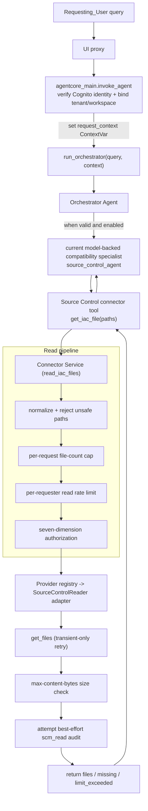

# Source Control Connector

> **Reference:** This document covers the **Source Control Connector** only. For the full
> platform guidance (overview, cost, deployment of the whole stack, MCP integration, testing,
> and more), see the [root README](../README.md).

The Source Control Connector (the "Connector") adds a safe, **opt-in read-only** IaC-context path
to the Game Backend & Infrastructure Agentic Workflows (GBAW) platform, which is otherwise
read-only against live AWS infrastructure. Rather than mutating live resources — or writing to the
source-control provider — the connector tool path **reads existing Infrastructure-as-Code (IaC)
sources** from an allowlisted repository/branch so the platform can review the current source of
truth. A file read is a provider-neutral concept; each provider adapter maps it to the provider's
native read API (the GitHub contents API, and so on). Per **Architecture Update v1.3** the
provider-**write** path (creating an unmerged change proposal for human review, then merging via
the existing CI/CD pipeline) has been **removed from the chat runtime** and is **future work tracked
by the open isolated-executor issue #314**, preserved only in branch history. The read-only
Connector documented here requires an operator-provisioned, provider-scoped read-only credential
and exposes **no** propose/merge/commit operation. The connector cannot independently verify the
credential's provider-side grants; operators must ensure the referenced secret does not contain a
write-capable or over-broad token. The read-only posture is a property of the type graph — the
shipped package has no `SourceControlWriter` interface and no importable, callable, or attribute-reachable
provider-write operation — not merely a runtime guard.

## Table of Contents

- [Architecture](#architecture)
- [Safety Posture](#safety-posture)
- [Component Layering](#component-layering)
- [Enablement Gate](#enablement-gate)
- [Request Flow](#request-flow-read-iac-files)
- [The Read Pipeline](#the-read-pipeline)
- [Authorization](#authorization)
- [Identity & Context Propagation](#identity--context-propagation)
- [Provider Abstraction](#provider-abstraction)
- [Configuration](#configuration)
- [IAM & Credential Isolation](#iam--credential-isolation)
- [Deployment Steps](#deployment-steps)
- [Audit](#audit)
- [Correctness Properties](#correctness-properties)
- [Source Layout](#source-layout)

## Architecture

The Connector is a product **tool capability**, not a fourth long-term AWS domain alongside
GameLift, EKS, and Cost. Its connector-owned path is:

`get_iac_file` → `read_iac_files` → `SourceControlReader` → provider adapter

The exact current runtime adds a model-backed compatibility hop above that path:

`Orchestrator` → `source_control_agent` → `get_iac_file` → connector service and adapter

Connector configuration must be valid and enabled before the Orchestrator can reach that path. The
service applies normalization, limits, authorization, provider selection, and best-effort audit
before returning read-only IaC content. Additional providers (GitLab, CodeCommit) can be added
without changing the connector tool contract.

> **Current compatibility plumbing:** the checked-in implementation conditionally appends
> `source_control_agent` from `agents/source_control_specialist.py`. That module uses the shared
> Strands `create_specialist_agent` factory; each invocation creates a nested model-backed Agent
> with the compatibility-named Source Control prompt and `get_iac_file` as its sole connector tool.
> This is a real execution/model hop today, but it is legacy exposure plumbing rather than the
> durable Source Control product boundary.

The Connector reuses existing platform components rather than re-implementing them:

| Concern | Reused component |
|---|---|
| Current model-backed exposure hop | `agents/source_control_specialist.py` via `agents/base_specialist.py::create_specialist_agent`; sole connector tool: `connector/tools.py::get_iac_file` |
| Credential retrieval | `utils/secrets.py::get_secret` (Secrets Manager, 5-min TTL cache, audit logging) |
| Config | `config/settings.py` (`GBAW_`-prefixed env vars) |
| Rate limiting | `utils/security.py::check_rate_limit`, `get_rate_limit_key`, `RateLimitExceeded` |
| Audit redaction | `utils/security.py::sanitize_log_data` |
| Request-scoped identity | `utils/request_context.py` (`set_request_context` / `get_request_context`) |
| Logging / local visibility | `utils/logger.py::logger` → stdout → ADOT/CloudWatch |

Authorization is **not** delegated to a shared helper; it is the Connector's own seven-dimension
`AuthorizationPolicy` (see [Authorization](#authorization)).

## Safety Posture

The design preserves the platform's core safety guarantees:

- **The AgentCore Runtime IAM role stays read-only against live AWS infrastructure.** The only
  new grants are `secretsmanager:GetSecretValue` scoped to a single read-credential secret ARN and
  (optionally) `logs:CreateLogStream` + `logs:PutLogEvents` scoped to the dedicated connector audit
  log group. No live-infrastructure write actions are added.
- **The read credential lives in a Secrets Manager secret** — never in IAM, never in an
  environment variable (only its ARN is passed as an env var). The operator must provision and
  verify a provider-scoped, fine-grained **read-only** token; the connector cannot independently
  inspect its provider-side grants. A compromised token can be used directly up to those grants,
  outside the connector's seven-dimension policy boundary.
- **The Connector is disabled by default.** When disabled, the platform behaves exactly as it
  does today, and the connector tool path is not exposed to the Orchestrator. (Current plumbing
  implements this by not appending the compatibility wrapper.)
- **The abstraction defines only read operations.** There is deliberately **no** write, merge,
  approve, commit, or close operation and no `SourceControlWriter` interface, so it is
  structurally impossible for the chat runtime to mutate a provider. The provider-write path is
  future work tracked by the open isolated-executor issue #314, not a present component here.

## Component Layering

The Connector is organized into four product layers, from tool-facing down to the provider wire.
The current model-backed `source_control_agent` compatibility specialist sits above these layers and
routes to the connector tool; it is not itself part of the connector core:

1. **Connector tool layer** (`connector/tools.py`) — the top-level `@tool` function
   `get_iac_file(paths, repository=None, target_branch=None)` with a provider-agnostic,
   JSON-serialisable signature. This is the Connector capability exposed to the Orchestrator/LLM.
   The tool never raises to the model; it returns a structured, secret-free dict, converting any
   unexpected exception into a safe `error` dict. Current routing exposes the tool through the
   `source_control_agent` compatibility wrapper.
2. **Connector service layer** (`connector/service.py`) — `read_iac_files(...)` orchestrates the
   read pipeline for every read (see below). Provider-agnostic.
3. **Provider abstraction layer** (`connector/provider.py`) — the `SourceControlReader` ABC
   defining the fixed **read** operation set (`get_file`/`get_files`) plus the neutral
   `ProviderAuth` credential-acquisition contract; a registry (`connector/registry.py`) selects the
   concrete adapter from the configured provider name.
4. **Provider adapter layer** (`connector/github_provider.py`) — a concrete adapter implements the
   read operations against its provider's REST API. Provider-specific types never escape this
   layer. The first adapter targets GitHub; additional adapters (GitLab, CodeCommit) plug in
   without changing the layers above.

## Enablement Gate

`run_orchestrator` builds the available tool set for each request. It calls
`SourceControlConfig.load()`, which reads and validates the `GBAW_SCM_*` variables, and exposes the
connector path only when the resulting configuration is enabled. `SourceControlConfig` composes
**three** cohesive sub-contracts, each of which reads its own slice of the `GBAW_SCM_*` values and
accumulates its own `config_errors`:

- **`DomainConfig`** (source-control read domain) — the repository allowlist
  (`authorization_policy`) and the `authorized_groups`.
- **`ConnectorConfig`** (provider-neutral core) — `provider`, rate-limit max/window, provider
  timeout, retry attempts, `max_files_per_request`, `max_content_bytes`, and the audit log group.
- **`AdapterConfig`** (provider adapter) — the read-credential secret ARN and the optional provider
  base URL.

The composed result is a frozen `SourceControlConfig` with an `enabled` boolean:

- `enabled` is `True` **only when** the enablement flag is truthy **and every** sub-contract
  validates — a supported provider with a registered adapter, a non-empty allowlist, non-empty
  authorized groups, an ARN-shaped read-credential secret ARN, a present audit log group, and
  rate-limit / timeout / retry / size values in range.
- When `enabled` is `False`, the `source_control_agent` compatibility specialist is not included in
  the per-request Orchestrator tool set, so its nested `get_iac_file` connector tool is not
  model-reachable. Invalid enabled configuration emits a sanitized `event="scm_config_error"`
  application audit/log event; it does not expose a partially configured connector.

Disablement is the safe default and the *only* state reachable on misconfiguration —
`SourceControlConfig.load()` **never raises**; when the flag is not truthy it short-circuits to a
well-formed disabled off state (no errors, no audit), and when the flag is truthy but validation
fails it accumulates every failure across the three sub-contracts, emits one sanitized
configuration-error event, and forces `enabled=False`.

> **Current compatibility plumbing:** the per-request tool-set branch imports and appends the
> model-backed `source_control_agent` when configuration is valid. Invoking that specialist creates
> a nested Strands Agent whose only connector operation is `get_iac_file`; this mechanism does not
> make Source Control a peer long-term AWS domain.

## Request Flow (read IaC files)



For hosted requests, identity and groups come from independently verified Cognito identity; tenant
and workspace are server-bound. These trusted values are transported through the request
`ContextVar`, never through tool/model arguments. The explicit local-development identity bypass
instead uses validated body context and must never be exposed as a trusted hosted boundary. Effective repository and branch come from the matched allowlist entry. Each
rejection path fails closed before a provider read and attempts to emit an `scm_read` audit event.

## The Read Pipeline

`read_iac_files` runs these steps in order, failing closed at each one before any provider read:

1. **Path normalization / rejection** — each requested path is canonicalized to a repo-relative
   POSIX path by `_normalize_path`. Safe normalization only collapses `.` segments and duplicate
   separators. A path is **rejected** (not silently rewritten) when it is **absolute** (leading
   `/`), contains **any** `..` segment, or contains a backslash, NUL, `#`, `?`, `%`, or any ASCII
   control character (including DEL). Rejection raises `PathTraversalError`, which the caller
   converts into a fail-closed empty result and attempts to emit a `path_invalid` audit event with
   no provider read.
2. **Per-request file-count cap** — if the number of requested paths exceeds
   `config.connector.max_files_per_request`, no provider fetch is performed and a `FileFetchResult`
   with `limit_exceeded=True` is returned while the service attempts a `limit_exceeded` audit event.
3. **Read rate limit** — `check_rate_limit(get_rate_limit_key(requester, "scm_read"), ...)`
   per-requester; exceeding it returns an empty result and attempts a `rate_limited` audit event.
4. **Authorization** — the requested `(repository, target_branch)` selectors (defaulting to the
   first allowlist entry / its first branch when omitted), the normalized paths, and the
   requester's tenant/workspace/groups are evaluated against all **seven** dimensions (see below).
   On a violation of any dimension the read is rejected with no provider read and the service
   attempts an audit event naming the failed dimension; the effective repo/branch always come from
   the matched allowlist entry, never from free-form input.
5. **Provider read (transient-only retry)** — the selected `SourceControlReader.get_files` fetches
   exactly the normalized paths from the matched repo/branch. A `ProviderTransientError`
   (provider rate limits, temporary 5xx/unavailability, read timeouts) is retried up to
   `config.connector.retry_max_attempts` total attempts; a `ProviderAuthError` and any other
   permanent `ProviderError` are **not** retried. A **terminal** provider failure attempts to
   persist a sanitized `scm_read` `outcome="error"` event (the reason is the exception **class
   name** only — never a message, token, or provider payload) and then re-raises, so the tool
   wrapper still returns its safe error dict.
6. **Size check** — a result whose total content size exceeds `config.connector.max_content_bytes`
   is rejected with no files served and a `size_exceeded` audit attempt.
7. **Served-read audit** — the read path attempts to emit/persist a best-effort event containing
   requester / tenant / workspace / effective repo / effective branch / normalized paths / found
   count / missing. The outcome is `served` whenever at least one file is returned (including a
   partial found/missing result), and `not_found` when no files are returned and paths are missing.
   The result carries **no** write-usable revision.

Failure-mode mapping (GitHub adapter): connect error / connect-timeout → `ProviderUnavailableError`;
read/transport timeout → `ProviderTransientError`; HTTP 401/403 → `ProviderAuthError` (no retry);
HTTP 429/5xx → `ProviderTransientError` (retryable); other 4xx → `ProviderError` (no retry). A
`404` on a read is treated as "file absent" and reported as a missing path, not an error.

## Authorization

Authorization is enforced by the Connector's own `AuthorizationPolicy.authorize(...)`
(`connector/config.py`), wrapping the operator-approved allowlist entries owned by `DomainConfig`.
It is a stateless evaluator over **seven dimensions**, evaluated in order; the **first** failing
dimension is reported in the returned `Decision.failed_dimension`:

1. **tenant** — entries whose `tenants` is empty (any tenant) or list the request's tenant are
   eligible; if none are eligible, fail on `tenant`.
2. **workspace** — among tenant-eligible entries, those whose `workspaces` is empty (any) or list
   the workspace remain eligible; if none, fail on `workspace`.
3. **repository** — at least one eligible entry's `repo` must equal the requested repo (exact,
   case-sensitive, full-string).
4. **branch** — collect **every** repo-matching eligible entry that lists the branch in its
   `target_branches` (exact, case-sensitive). If none, fail on `branch`. (All matches are kept, so
   an operator can list several entries for the same repo+branch that each scope different
   paths/extensions.)
5. **path** — the request passes when **at least one** of the branch-matching entries permits every
   requested path. Prefix matching is directory-boundary aware: after normalizing a trailing slash,
   a path must equal the normalized prefix or start with the normalized prefix plus `/`. Thus
   `infra/` permits `infra` and `infra/main.tf`, but does not admit `infra-secrets/main.tf`. An
   empty `path_prefixes` permits any path.
6. **extension** — among the entries that passed the path check, the request passes when at least
   one also permits every requested extension (`str.endswith`); an empty `extensions` permits any
   extension. The first entry passing **both** path and extension becomes the **matched** entry and
   supplies the effective repo/branch. If some entry passed the path check but none passed the
   extension check, the failed dimension is `extension`; otherwise `path`.
7. **group** — the requester's `groups` must intersect `config.domain.authorized_groups`.

On success the `Decision` carries the effective repo/branch from the matched entry; on denial it
carries only the failed dimension and no provider read is performed. Because multiple matching
entries are all considered, a request is authorized when **any** single matching entry permits all
of the requested paths and extensions.

## Identity & Context Propagation

`get_iac_file` declares only read selectors (`paths`, and optional
`repository`/`target_branch`) — never the `Requesting_User` identity. Deriving identity from
model/tool arguments would be spoofable, so authorization identity is taken from a request-scoped
`contextvars.ContextVar` in `utils/request_context.py`.

For hosted requests, the runtime independently verifies the Cognito access token and derives the
requester and groups from that verified identity. Tenant and workspace are server-owned deployment
bindings, not body or model input. `agentcore_main.invoke_agent` places those trusted values into
`agent_context`, sets the request `ContextVar` immediately before `run_orchestrator`, and resets it
in a `finally` block so identity cannot leak between invocations:

```python
_context_token = set_request_context(agent_context)
try:
    response = run_orchestrator(query=user_prompt, context=agent_context)
finally:
    reset_request_context(_context_token)
```

The Connector service reads `user_id`, `groups`, `tenant`, and `workspace` through
`get_request_context()` in `_read_path_context`; none are accepted from agent/model-supplied input.
Effective repository and branch are taken from the matched allowlist entry.

The Connector depends on the trusted identity boundaries established by **closed #278** and
**merged #334**. Read authorization directly consumes the #278 request-scoped identity seam; #334
hardens approval identity for future governed operations and does not add a connector read or write
capability.

## Provider Abstraction

A fixed **read** operation set shared by all adapters. All parameters and return values use
provider-agnostic dataclasses (`connector/models.py`: `FileContent`, `FileFetchResult`) or Python
primitives; no provider-specific type is referenced in the signatures. There is deliberately **no**
write, merge, approve, or close operation and no `SourceControlWriter` interface.

```python
class SourceControlReader(ABC):
    def get_file(self, repo: str, branch: str, path: str) -> FileContent | None: ...
    def get_files(self, repo: str, branch: str, paths: list[str]) -> FileFetchResult: ...
```

Credential acquisition is owned by each adapter behind a neutral `ProviderAuth` contract
(`apply(request: OutboundRequest) -> None`), so the connector core issues no credential retrieval of
its own and a token-based adapter and a future IAM-native (SigV4) adapter satisfy the same contract.

Typed exceptions (`ProviderUnavailableError`, `ProviderAuthError`, `ProviderTransientError`,
`ProviderError`, `UnsupportedProviderError`) let the service layer react uniformly. A
provider-neutral registry (`connector/registry.py`) selects the adapter for the configured provider
and fails closed when no adapter is registered:

```python
def get_provider(config: SourceControlConfig) -> SourceControlReader:
    provider_name = config.connector.provider
    factory = _REGISTRY.get(provider_name) if provider_name is not None else None
    if factory is None:
        raise UnsupportedProviderError(provider_name)   # caught at load -> disabled
    return factory(config)
```

Adapters **self-register** at import time (`registry.register("github", GitHubProvider)`), so the
neutral core never imports a concrete adapter module.

**Adapter details (GitHub example).** The GitHub adapter uses `httpx` with a per-request timeout
from `GBAW_SCM_PROVIDER_TIMEOUT_SECONDS`; **no local `git clone`** (the container FS is read-only) —
it calls the GitHub Contents REST endpoint. The adapter requests the read credential through
`get_secret(config.adapter.read_credential_secret_arn, source="secretsmanager")` for each connector
operation; the shared helper may serve the value from its five-minute TTL cache, so credential
rotation or revocation can take up to that cache window to be observed. The adapter places the
value in the `Authorization: Bearer <token>` header and never logs it. Outbound HTTPS to the
provider host
(`api.github.com`, or a configured enterprise base URL) must be allowed from the AgentCore runtime.

## Configuration

All configuration is read **exclusively** from `GBAW_`-prefixed environment variables; any other
source is ignored. Raw parsing lives in `config/settings.py`; validation and the `enabled`
decision live in `SourceControlConfig.load()` (composing `DomainConfig` / `ConnectorConfig` /
`AdapterConfig`) so misconfiguration → disabled + audit, never an import-time crash.

| Variable | Default | Required when enabled | Notes |
|---|---|---|---|
| `GBAW_SCM_CONNECTOR_ENABLED` | `false` | — | Truthy = case-insensitive `{"true","1","yes"}` (trimmed) |
| `GBAW_SCM_PROVIDER` | — | ✅ | e.g. `github`; must have a registered adapter |
| `GBAW_SCM_READ_CREDENTIAL_SECRET_ARN` | — | ✅ | Fully-qualified Secrets Manager secret **ARN** (no wildcards). A bare name or raw credential is rejected and its value omitted from audit output |
| `GBAW_SCM_REPO_ALLOWLIST` | — | ✅ | See grammar below; must parse to ≥1 entry |
| `GBAW_SCM_AUTHORIZED_GROUPS` | — | ✅ | Comma-separated Cognito groups; ≥1 required |
| `GBAW_SCM_AUDIT_LOG_GROUP` | — | ✅ | CloudWatch Logs group backing the durable audit sink |
| `GBAW_SCM_RATE_LIMIT_MAX` | `5` | — | 1..1000 |
| `GBAW_SCM_RATE_LIMIT_WINDOW_SECONDS` | `3600` | — | 60..86400 |
| `GBAW_SCM_PROVIDER_TIMEOUT_SECONDS` | `30` | — | 1..300 |
| `GBAW_SCM_RETRY_MAX_ATTEMPTS` | `3` | — | 1..10 |
| `GBAW_SCM_MAX_FILES_PER_REQUEST` | `20` | — | Positive int; per-request read cap |
| `GBAW_SCM_MAX_CONTENT_BYTES` | `1048576` | — | Positive int; max total content bytes per read (1 MiB) |
| `GBAW_SCM_PROVIDER_BASE_URL` | — | — | Optional; when set must be an absolute **https** URL (self-hosted/enterprise endpoint) |

Out-of-range or non-integer numeric values fall back to their documented default **and** accumulate
a config error (which disables the connector).

**Repository allowlist grammar** — a compact, env-friendly encoding parsed by `_parse_allowlist`
into `AllowlistEntry` values. Entries are `;`-separated; each entry splits on the first `=` into a
repo and a spec, and the spec is up to **five** `:`-separated segments:

```
allowlist  := entry ( ";" entry )*
entry      := repo "=" branches [ ":" paths [ ":" extensions
                                  [ ":" tenants [ ":" workspaces ] ] ] ]
branches   := branch ( "," branch )*   # required, ≥1
paths      := prefix ( "," prefix )*   # optional; empty => any path
extensions := ext    ( "," ext )*      # optional; empty => any extension
tenants    := tenant ( "," tenant )*   # optional; empty => any tenant
workspaces := ws     ( "," ws )*       # optional; empty => any workspace

# repo+branch only (backward compatible):  org/iac-repo=main,release
# fully specified:  org/iac=main,release:infra/,modules/:.yaml,.tf:acme:prod,staging
```

A **missing** segment means "any" for that dimension, so existing repo+branch-only entries parse
exactly as before. Parsing is fail-closed: an entry with no `=`, an empty repository, no branches,
or more than five `:`-separated groups is a per-entry error that disables the connector. Empty
`;`-separated segments are ignored (a trailing separator is harmless). Repository/branch comparison
at the tool boundary is case-sensitive, full-string — no partial/prefix/wildcard matching.

## IAM & Credential Isolation

Two scoped, conditional statements are added to the existing `AgentCoreExecutionRole` in
`infrastructure/cloudformation/01-base-infrastructure.yaml`. **No live-infrastructure write actions
are added.**

```yaml
- !If
  - ScmReadCredentialActive
  - PolicyName: ScmReadCredentialAccess
    PolicyDocument:
      Version: '2012-10-17'
      Statement:
        - Sid: ScmReadCredentialRead
          Effect: Allow
          Action: secretsmanager:GetSecretValue
          Resource: !Ref ScmReadCredentialSecretArn   # scoped to the connector read secret only
  - !Ref 'AWS::NoValue'
```

Relevant template parameters and conditions:

- **`ScmReadCredentialSecretArn`** (parameter) — empty, or a fully-qualified Secrets Manager secret
  ARN. Its `AllowedPattern` **disallows `*` and `?` wildcards** so a broad ARN cannot widen the
  scoped grant to multiple secrets. The secret is **operator-provisioned** (not created by the
  stack), so the token never lives in template state.
- **`ScmConnectorEnabled`** (parameter, default `'false'`) — `deploy.sh` passes `'true'` only when
  `GBAW_SCM_CONNECTOR_ENABLED` is truthy.
- **`ScmReadCredentialActive`** (condition) = `ScmConnectorIsEnabled` **AND**
  `ScmReadCredentialConfigured`. The `GetSecretValue` statement is added **only** when both hold, so
  a disabled deployment carries no connector secret permission even if an ARN is otherwise present.
- **`ScmAuditLogGroupName`** (parameter) + **`ScmAuditLogGroupConfigured`** (condition) — when set,
  the template creates the `ScmAuditLogGroup` (`AWS::Logs::LogGroup`, 90-day retention) and adds a
  scoped `ScmAuditLogAccess` policy (`Sid: ScmAuditLogWrite`) granting `logs:CreateLogStream` +
  `logs:PutLogEvents` on that log group only.

## Deployment Steps

The Connector ships **disabled**. To enable it against an IaC repository (GitHub shown as the
example provider):

1. **Provision the read credential.** Create a Secrets Manager secret containing a provider-scoped,
   fine-grained **read-only** token for the target repo. Note its fully-qualified ARN.

2. **Grant scoped read of that secret (and provision the audit log group).** Deploy the base
   infrastructure stack with `ScmReadCredentialSecretArn` set to the secret's ARN,
   `ScmConnectorEnabled=true`, and `ScmAuditLogGroupName` set to the audit log group name. This adds
   the single `secretsmanager:GetSecretValue` statement scoped to that ARN plus the scoped audit-log
   write grant — and nothing else.

3. **Set the connector environment.** Provide the `GBAW_SCM_*` variables (see
   [Configuration](#configuration)). At minimum:

   ```bash
   export GBAW_SCM_CONNECTOR_ENABLED=true
   export GBAW_SCM_PROVIDER=github
   export GBAW_SCM_READ_CREDENTIAL_SECRET_ARN=arn:aws:secretsmanager:us-west-2:123456789012:secret:gbaw/scm-read-AbCdEf
   export GBAW_SCM_REPO_ALLOWLIST="org/iac-repo=main,release"
   export GBAW_SCM_AUTHORIZED_GROUPS="iac-reviewers"
   export GBAW_SCM_AUDIT_LOG_GROUP="/gbaw/scm-audit"
   ```

   Only the secret **ARN** is ever passed as an env var — never the credential value.

4. **Deploy.** `scripts/deploy.sh` wires the `GBAW_SCM_*` vars through the existing
   `agentcore launch` env mechanism (the same path used for KB IDs and prompt ARNs). The optional
   `GBAW_SOURCE_CONTROL_PROMPT_ARN` is a compatibility-named managed prompt for connector
   read/tool behavior; when set it overrides the code-defined fallback used by the current wrapper.

5. **Allow egress.** Ensure the AgentCore runtime can reach the provider host (`api.github.com` or
   your configured enterprise base URL) over HTTPS.

6. **Verify.** For each request, `run_orchestrator` validates connector configuration while
   building its tool set. Valid enabled configuration exposes `get_iac_file`, currently through the
   compatibility wrapper. Invalid configuration leaves the connector path unexposed and emits a
   sanitized application audit/log event describing the reason.

## Audit

Handled read outcomes attempt to emit a structured `scm_read` event through the CloudWatch Logs
sink (`connector/audit.py::AuditSink`, cached per audit-log-group name), in addition to a
best-effort local `logger` line for visibility. Every string field is passed through
`sanitize_log_data`; the read credential is never placed in an event field.

Audit persistence is **best-effort** and reads are not gated on it. The service ignores an
unconfirmed or failed sink write, so a served read is never aborted solely because its audit event
could not be persisted. Terminal provider failures attempt to persist a sanitized
`outcome="error"` event before re-raising. Rejections likewise attempt an event before returning a
fail-closed result.

Current outcomes are `served`, `not_found`, `error`, and `rejected`. Rejection reasons include
`path_invalid`, `limit_exceeded`, `rate_limited`, the failed authorization dimension, and
`size_exceeded`. Intermediate transient retries produce local warnings; the service emits one final
handled request outcome rather than an event for each retry.

The read returns no write-usable revision. It emits no pre-read intent event, performs no
intent/outcome correlation, uses no idempotency key, and performs no reconciliation of ambiguous
outcomes. Those mutation-oriented guarantees belong to the future isolated executor, not this
best-effort read audit path.

## Correctness Properties

The read-only Connector is validated by unit, example, and property-based tests (Hypothesis) under
`backend/tests/unit/`. Representative coverage:

| Area | Test(s) |
|---|---|
| Truthy + valid config enables; any invalid/absent required value disables; per-request exposure | `test_connector_config_enable_property.py`, `test_enablement_tool_exposure_property.py` |
| Config read exclusively from `GBAW_SCM_*`; three-contract separation | `test_connector_config_env_source_unit.py`, `test_config_separation_property.py` |
| Allowlist grammar parse (round-trip / fail-closed) | `test_allowlist_parse_property.py` |
| Seven-dimension read authorization | `test_seven_dimension_read_authz_property.py` |
| Multiple matching entries and directory-boundary-aware path prefixes | `test_allowlist_all_matching_entries_unit.py`, `test_path_prefix_boundary_unit.py` |
| Unsafe path and character rejection | `test_path_traversal_rejection_unit.py` |
| Trusted request identity seam and ContextVar propagation | `test_invoke_agent_trusted_identity_e2e.py` |
| Read service retry, count/rate/size limits, and audit outcomes | `test_read_service_retry_and_limit_audit_unit.py` |
| Audit sink and non-gating best-effort reads | `test_connector_audit_sink_unit.py`, `test_read_audit_best_effort_unit.py` |
| Provider-agnostic tool signature; registry factory / read URL shape | `test_tools_agnostic_signatures_example.py`, `test_github_provider_factory_unit.py`, `test_github_provider_read_url_unit.py` |
| Scoped IAM read-credential grant; deploy wiring; prompt wiring | `test_iam_scm_credential_smoke.py`, `test_deploy_scm_wiring_smoke.py`, `test_source_control_prompt_wiring_example.py` |

> The above maps reviewer-facing concerns to the test files present in the suite; it is not an
> exhaustive per-property enumeration.

## Source Layout

The `connector/` package is the product implementation. Agent and prompt names below are current
compatibility plumbing for exposing the connector tool; they do not define a Source Control domain
agent.

```
backend/src/
├── connector/                       # Source Control Connector product code
│   ├── __init__.py
│   ├── audit.py             # AuditSink — best-effort CloudWatch Logs audit sink
│   ├── config.py            # SourceControlConfig (Domain/Connector/Adapter), AllowlistEntry,
│   │                        #   AuthorizationPolicy (seven dimensions), load() + validation
│   ├── models.py            # FileContent, FileFetchResult (read-path only)
│   ├── provider.py          # SourceControlReader ABC + ProviderAuth + typed exceptions
│   ├── registry.py          # provider-neutral registry + get_provider(SourceControlConfig)
│   ├── github_provider.py   # GitHub read adapter (self-registers with the registry)
│   ├── service.py           # read_iac_files read pipeline
│   └── tools.py             # get_iac_file (@tool), top-level connector capability
├── agents/                          # Current compatibility plumbing
│   ├── source_control_specialist.py   # legacy source_control_agent tool wrapper
│   ├── optimized_prompts.py           # compatibility-named connector prompt resolution
│   └── orchestrator.py                # per-request conditional tool exposure
├── config/settings.py                 # GBAW_SCM_* env parsing
└── utils/request_context.py           # request-scoped identity ContextVar

infrastructure/cloudformation/01-base-infrastructure.yaml   # scoped secret-read + audit-log IAM grants
scripts/deploy.sh                                           # GBAW_SCM_* env wiring
```

> Note: `connector/iac_validation.py` exists in the package but is **not** part of the read path —
> `service.py` performs no IaC parse/validation on reads (reads only fetch existing content).

> Note: there is **no** `connector/executor/` directory in the shipped package on this branch. The
> isolated write-path executor is **future work tracked by #314 (still open)** and lives only in
> branch history — it is not a present component of the read-only connector.
